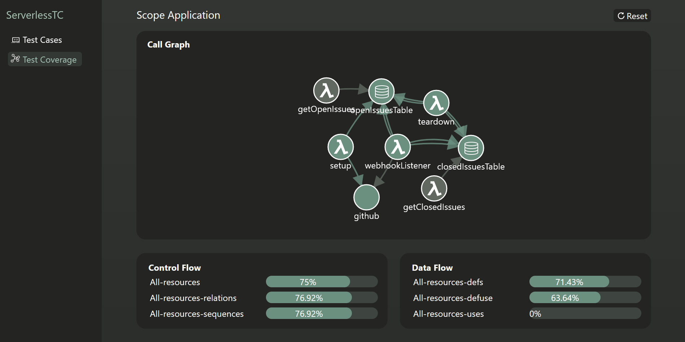

# Serverless Test Coverage

*This is a proof-of-concept implementation for demonstrating the usage of distributed tracing to determine coverage criteria in serverless applications. Therefore, the repository includes sample data to model the [Scope Application](https://github.com/serverless/scope)<sup>[1](#footnote1)</sup> for managing GitHub projects.*

**Content:**

- [Setup](#anker-setup)
  - [Starting the application](#anker-starting-application)
  - [Further necessary steps and configurations](#merging-tracing-data)
- [Usage](#anker-usage)
- [Testing](#anker-testing)
- [Current Limitations](#anker-limitations)

<a name="anker-setup"></a>
## Setup

<a name="anker-starting-application"></a>
### Starting the application

The application consists of three components: a collector, a backend and a frontend.
Each of these components has to be started individually.

#### Start Collector

The collector is realized by using a pre-existing OpenTelemetry Collector.
It can be started by entering the following docker command in the `collector` directory:

```
docker run \
 -v $(pwd)/config.yaml:/etc/otelcol/config.yaml \
 -v $(pwd)/../frontend/src/data/tracingData.txt:/data.txt \
 -p 4318:4318 \
 -p 4317:4317 \
 otel/opentelemetry-collector:0.54.0
```

> **Note:** The collector is configured to export the data to a JSON file (`frontend/src/data/tracingData.txt`) which is subsequently used by the frontend and backend to manage and display the data.
> Ensure that all components have the right to access the file.
> In Linux, this can be achieved by the command `chmod 666 tracingData.txt`

#### Start the backend

The backend uses the [Express](https://expressjs.com/) framework and is responsible for managing tracing data, as well as storing and deleting test cases.

Before starting the application, install the necessary dependencies using `npm install` in the `backend` directory.

The backend can then be started using `npm start`.

> **Note:** The backend is responsible for managing file access for the frontend. As an alternative to this, a database could be used as well.


#### Start the frontend

The frontend is embodied by a [React](https://reactjs.org/) Web Application, which uses [D3](https://d3js.org/) for representing the call graph.

As before, install dependencies using `npm install` in the `frontend` directory.

The frontend can then be started using `npm start`.

<a name="anker-merging-tracing-data"></a>
### Further necessary steps and configurations

#### Modeling the application

In order to be able to determine the test coverage of the application, possible operations between resources have to be modeled first. This is done by specifying relevant information in a `JSON` file. Details on which information has to be included can be found in the following.

<details><summary>Details on modelling the application</summary>

The JSON file includes two arrays: `nodes`, for modelling the resources of the application and `links` for modeling the relations between those resources.

*Nodes:*

A node has an `id`, a `name`, and a `type`. The `id` is used for mapping purposes and, in the current implementation, equals the resource name of AWS. The `name` can be chosen randomly and is for display purposes only. Finally, the `type` is used to identify resources for data flow criteria. Additionally, it is used for display purposes. Currently, the following types are attached with either displaying or computational purposes: `database`, `lambdaFunction`.

*Links:*

Relations between `nodes` are specified via `links`. A `link`, therefore, includes a `source` (the `id` of the source `node`) and a `target` (the `id` of the target `node`). Additionally, the operation type (e.g. a `PutItem` or `Scan` operation) has to be specified.

*Exemplary JSON file:*

Given those elements, an example model of a simple application can look like the following:

```JSON
"nodes": [
  {
    "id": "1",
    "name": "OrderTable",
    "type": "database"
  },
  {
    "id": "2",
    "name": "storeOrder",
    "type": "lambdaFunction"
  }
],
"links": [
  {
    "source": "2",
    "target": "1",
    "operation": "PutItem"
  }
]
```

</details>

The modeled architecture has to be stored in the `architecture.json` file in the `frontend/src/data` directory. Currently, this file contains the modeled architecture of the [Scope](https://github.com/serverless/scope) application.

#### Attaching tracing information

In order to generate tracing data, the observed application has to be instrumented. This can be, for instance, done by using OpenTelemetry. A detailed explanation of how OpenTelemetry can be integrated into serverless applications can be found [here](). However, other instrumentation strategies, such as [Zipkin]() or [Apache SkyWalking](), can be used as well.

> **Note:** Currently, only the usage of OpenTelemetry is explicitly supported.

<a name="anker-usage"></a>
## Usage

After starting the components, the application is reachable on port `3000`.
The application comprises two main functionalities: managing and running test cases and observing test coverage.

Initially, no edges of the call graph are marked visited. Likewise, all coverage criteria are 0%. When test cases are executed (via `Run` of a single test case of `Run all`), the applications append the information to the call graph. Coverage criteria are calculated accordingly.

The coverage can be reset by using the `reset button` in the top right-hand corner. As a result, the call graph and the coverage criteria adopt the initial state.

<p align="center">

</p>

<a name="anker-testing"></a>
## Testing

The computation of the coverage criteria was tested using [Mocha](https://mochajs.org/). The tests can be run using the following command in the root directory:

```
npm run test-coverage-criteria
```

<a name="anker-limitations"></a>
## Current Limitations

The proposed application functions as proof-of-concept and is tailored to the application with the Scope application in conjunction with OpenTelemetry. Therefore, known limitations are:

- No coverage of direct interactions between two Lambda functions
- No interactions between Lambda functions using queues

Aspects that should work but have not been explicitly tested are:

- Mapping and calculation of test coverage when retrieving a single database element (`GetItem` instead of `Scan` operation)
- Usage of a database other than DynamoDB


----
<a name="footnote1">1</a>: The Application can be deployed to the AWS environment following the instructions of the corresponding GitHub repository. As it is not advised to use `sync-request` in production [[source](https://www.npmjs.com/package/sync-request)], and it does not lead to tracing results when using the AWS layer for OpenTelemetry, the usage of the module is replaced with the `then-request`.
